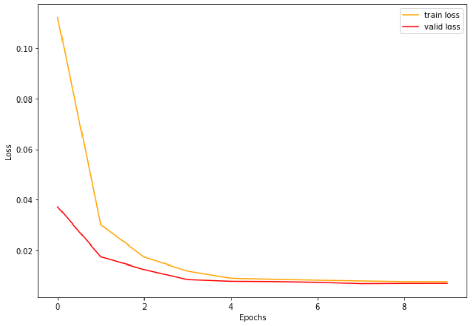

# pytorch U-Net with Carvana dataset

Dataset download from: https://www.kaggle.com/c/carvana-image-masking-challenge/data

## Unet Architecture

The original paper by Olaf Ronneberger, Philipp Fischer, Thomas Brox: https://arxiv.org/abs/1505.04597

I changed the U-net structure a little by replacing ReLU with GELU

My model has $17,267,393$ parameters, and $138,93$ GB mult-adds

## Training

I use adamW instead of SGD or adam optimizer

I training with $10\ epochs$, $batch\_size = 4$, resize image to $(572, 572, 3)$. Learning rate start from $1e-4$. I use 2 learning rate scheduler are ExponentialLR with $gamma = 0.9$ and MultiStepLR with $gamma = 0.1$ and $milestones=[4,8]$

## Note at GPU

The model has be trained from scratch on a Tesla P100 16GB provided by Colab pro. During the training, my model use about 13GB of 16GB memory of GPU.

## Result

Download checkpoint of model in: [checkpoint](https://drive.google.com/file/d/1hBTdUi81ppMnSZr9cLOVogmAnv8Yhxio/view?usp=sharing)

Detail in Carvana_competition_U_net.ipynb file